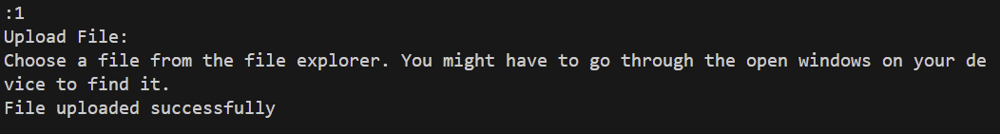

## Smart Document Analyzer (mainly cloud)

**Mission:** Analyze Catalog Search summarize Topics

## Overview:

This application provides a secure platform for users to upload various types of documents, and get various forms of information about the text.

### 4/7/2024 Update:

- Added P2P Functionality:
    - List current online users

### 4/1/2024 Update:

- Transitioned application from terminal to React Web Application
- Successfully called to web app APIs:
    - registration, login
    - uploading files, listing upser files, removing files (partially working)
- Web app is set up on github pages (https://lchin10.github.io/chin-ec530-project2/)
- Database is set up with Render (https://chin-ec530-project2-2.onrender.com/ to call APIs in app)

### 3/23/2024 Update:

- Created working APIs for:
    - registration, login, deleting user, and changing password in module '*auth_api.py*'
    - uploading files, listing user files, and removing files in module '*file_upload.py*'
- Found a way to set up all APIs from multiple modules at once.
- Added logs and profiling for API calls
- Created database (database.db) using sqlite3
    - Created a script to reset and clear the existing database
- Created a client-side script to test API functionality

## How it works (previous application in terminal, not in use anymore):

1. **Create/reset the database:**

    This step is optional, but it clears the existing database and recreates it to start again with a new database.

    

2. **Run the API modules:**

    I created a python script (*flask_run.py*) to run all the API modules. This creates the Flask app, registers each module's API blueprints, and runs the app.

    

3. **Start the application**

    To start the application, run the client-side python application (*test.py*). It will prompt you with instructions, as such:

    

    

    Once you successfully register, your information is stored in the databsae. Login and the application will prompt you with the next set of instructions.

    

    

    This will updatae the database and add a copy of the file to an uploads folder under your username.

    

    

    In addition, you can remove any file in your account.

    

    If you want, you can delete your account as you wish. It will remove all your information and files from the uploads folder and database.

    

## User Stories:

  - I should login to a secure service to upload my content
  - I should be able to upload documents
  - I should be able to upload PDFs or images.  The application should translate my documents to text
  - I want the service to tag all my documents and paragraphs within every document with the keywords and know the topics each document cover
  - I should be able to access different paragraphs of different documents based on keywords
  - I should be able to to find all positive, neutral and negative paragraphs and sentences
  - Keywords within paragraphs should be searchable in government opendata, wikipedia and media organizations, e.g., NYTimes
  - I should find definition of keywords using open services (e.g., OpenAI)
  - I should be able to get summaries of each document
  - I want to discover content from the WEB to enhance story
  - I want to know all names, locations, institutions and address in my documents.
  - I want to upload different types of files (CSV, DOC, etc.)

